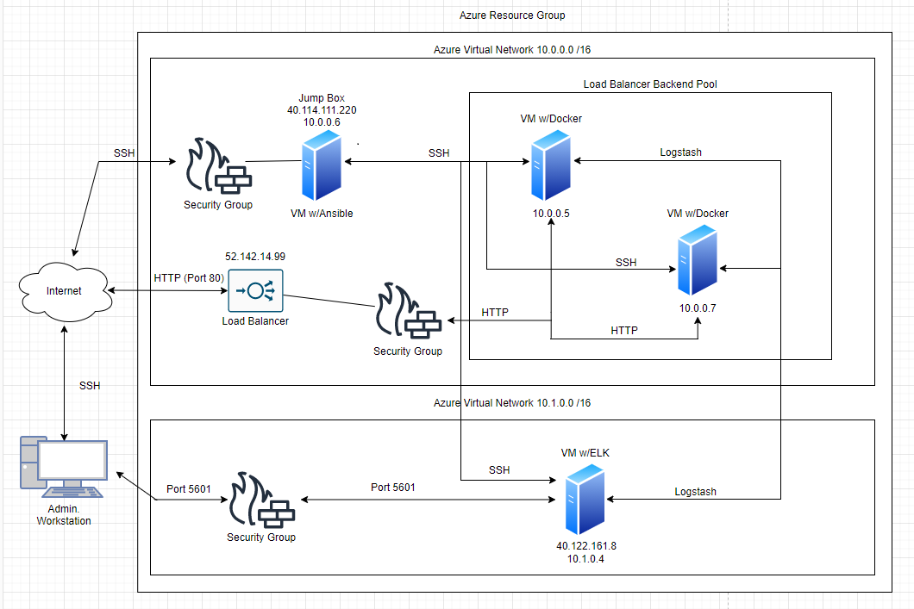

## Automated ELK Stack Deployment

The files in this repository were used to configure the network depicted below.

| Name     | Function   | IP Address | Operating System |
|----------|------------|------------|------------------|
| Jump Box | Gateway    | 10.0.0.6   | Linux            |
| Web-1    | Web Server | 10.0.0.5   | Linux            |
| Web-2    | Web Server | 10.0.0.7   | Linux            |
| ELK      | ELK Server | 10.1.0.4   | Linux            |
