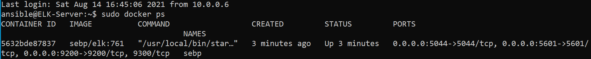

## Automated ELK Stack Deployment

The files in this repository were used to configure the network depicted below.

These files have been tested and used to generate a live ELK deployment on Azure. They can be used to either recreate the entire deployment pictured above. Alternatively, select portions of the YAML file may be used to install only certain pieces of it, such as Filebeat.

  - elk.yml

This document contains the following details:
- Description of the Topology
- Access Policies
- ELK Configuration
  - Beats in Use
  - Machines Being Monitored
- How to Use the Ansible Build

### Description of the Topology

The main purpose of this network is to expose a load-balanced and monitored instance of DVWA, the D*mn Vulnerable Web Application.

Load balancing ensures that the application will be highly available, in addition to restricting access to the network.
Load balancers protect the network from breakdowns on a single server, sending that traffic to other servers. Using a jump box reduces the attack surface of a network since all administrative access goes through one secure server.

Integrating an ELK server allows users to easily monitor the vulnerable VMs for changes to the etc folder and system configuration.
- Filebeat watches for changes to the file system
- Metricbeat records metrics about the system

The configuration details of each machine may be found below.

| Name     | Function   | IP Address | Operating System |
|----------|------------|------------|------------------|
| Jump Box | Gateway    | 10.0.0.6   | Linux            |
| Web-1    | Web Server | 10.0.0.5   | Linux            |
| Web-2    | Web Server | 10.0.0.7   | Linux            |
| ELK      | ELK Server | 10.1.0.4   | Linux            |

### Access Policies

The machines on the internal network are not exposed to the public Internet. 

Only the jump box machine can accept connections from the Internet. Access to this machine is only allowed from the following IP address:
- My home IP address

Machines within the network can only be accessed by the jump box. Only the jump box could access the ELK VM, and its IP is 10.0.0.6

A summary of the access policies in place can be found in the table below.

| Name     | Publicly Accessible | Allowed IP Addresses |
|----------|---------------------|----------------------|
| Jump Box | Yes                 | My Home IP           |
| Web-1    | No                  | 10.0.0.6             |
| Web-2    | No                  | 10.0.0.6             |
| ELK      | No                  | 10.0.0.6             |

### Elk Configuration

Ansible was used to automate configuration of the ELK machine. No configuration was performed manually, which is advantageous because many machines can be configured simply by adding their IP address to the Ansible hosts file.

The playbook implements the following tasks:
- Install Docker
- Install Python and the Docker Module for Python
- Set memory size to support Kibana
- Download and launch Docker container
- Enable Docker

The following screenshot displays the result of running `docker ps` after successfully configuring the ELK instance.

### Target Machines & Beats
This ELK server is configured to monitor the following machines:
- 10.0.0.5 (Web-1)
- 10.0.0.7 (Web-2)

We have installed the following Beats on these machines:
- Filebeat
- Metricbeat

These Beats allow us to collect the following information from each machine:
- Filebeat collects information about the machine's file system, which we use to monitor changes to logs, configurations, or settings. Metricbeat looks at system metrics, which we use to gauge system activity by examining CPU usage, disk io, free memory, etc.

### Using the Playbook
In order to use the playbook, you will need to have an Ansible control node already configured. Assuming you have such a control node provisioned: 

SSH into the control node and follow the steps below:
- Copy the elk.yml file to /etc/ansible/roles.
- Update the hosts file to include 10.1.0.4 under the [elk] group
- Run the playbook, and navigate to http://40.122.161.8:5601/app/kibana to check that the installation worked as expected.
